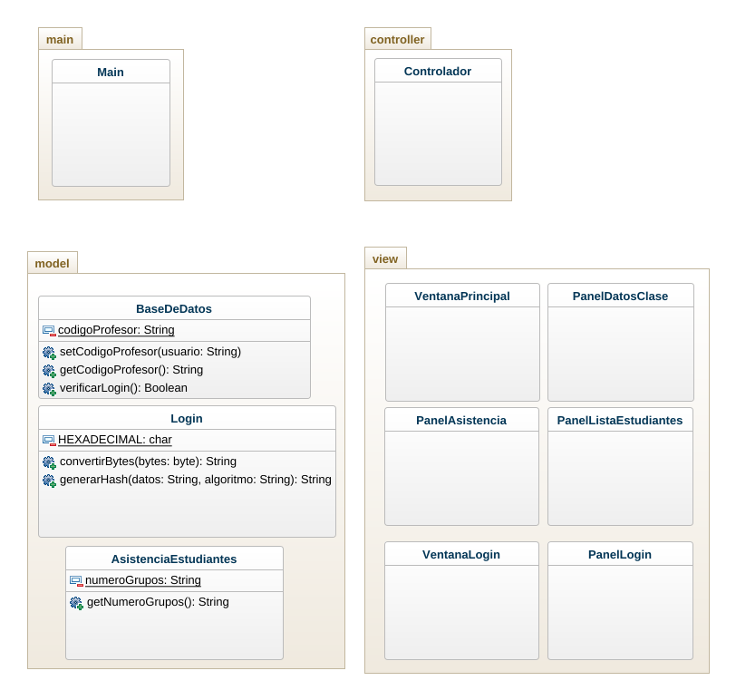

# Proyecto de asistencia estudiantes


Este proyecto es una herramienta para administrar la asistencia de los estudiantes en una institución educativa, para esto utiliza una base de datos relacional [MySQL](https://www.mysql.com/), a tráves de la librería [MySQL Connector](https://dev.mysql.com/downloads/connector/j/8.0.html), además de implementar el [patrón MVC](https://es.wikipedia.org/wiki/Modelo%E2%80%93vista%E2%80%93controlador), el cuál es bastante utilizado en la [Programación Orientada a Objetos](https://es.wikipedia.org/wiki/Programaci%C3%B3n_orientada_a_objetos).

### Configuración del proyecto

```bash
git clone https://github.com/sanmacorz/AsistenciaEstudiantes.git
cd AsistenciaEstudiantes/
```

### Uso del proyecto

```bash
cd src/
javac */*.java
java main.Main
```

## Diagrama de clases


